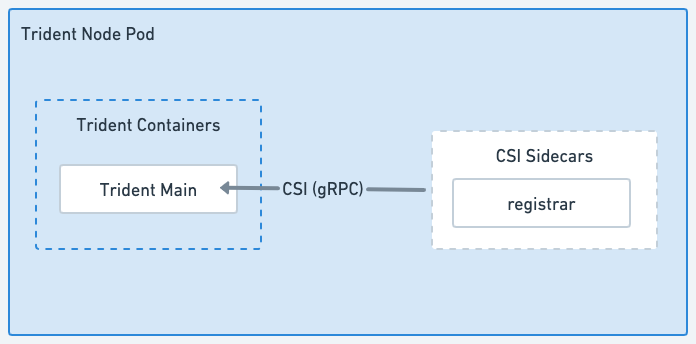

= Architektur von Trident
:hardbreaks:
:allow-uri-read: 
:icons: font
:imagesdir: ../media/

[role="lead"]
Trident wird als einzelner Controller-Pod plus einen Node Pod auf jedem Worker-Node im Cluster ausgeführt. Der Node Pod muss auf einem beliebigen Host ausgeführt werden, auf dem Sie potenziell ein Trident Volume mounten möchten.

== Allgemeines zu Controller-Pods und Node-Pods

Trident wird als einzelner oder mehrerer <<Trident Node Pods>>Cluster im Kubernetes-Cluster implementiert <<Trident Controller Pod>>und verwendet standardmäßige Kubernetes _CSI Sidecar Container_, um die Implementierung von CSI-Plug-ins zu vereinfachen. link:https://kubernetes-csi.github.io/docs/sidecar-containers.html["Kubernetes CSI Sidecar-Container"^] Werden von der Kubernetes Storage Community unterhalten.

Kubernetes link:https://kubernetes.io/docs/concepts/scheduling-eviction/assign-pod-node/["Knotenauswahl"^] und link:https://kubernetes.io/docs/concepts/scheduling-eviction/taint-and-toleration/["Toleranzen und Verfleckungen"^]schränken die Ausführung eines Pods auf einem bestimmten oder bevorzugten Node ein. Während der Trident-Installation können Sie Node-Selektoren und Toleranzen für Controller- und Node-Pods konfigurieren.

* Das Controller-Plug-in übernimmt Volume-Bereitstellung und -Management, beispielsweise Snapshots und Größenanpassungen.
* Das Node-Plug-in verarbeitet das Verbinden des Speichers mit dem Node.

.Auf dem Kubernetes-Cluster implementierte Trident
image::../media/trident-arch.png[Diagramm der Trident Architektur auf dem Kubernetes-Cluster.]

=== Trident Controller Pod

Beim Trident Controller Pod handelt es sich um einen einzelnen Pod, auf dem das CSI Controller Plug-in ausgeführt wird.

* Verantwortlich für die Bereitstellung und das Management von Volumes in NetApp Storage
* Management durch eine Kubernetes-Implementierung
* Kann je nach Installationsparameter auf der Steuerebene oder auf den Arbeitsknoten ausgeführt werden.

.Trident Controller Pod-Diagramm
image::../media/controller-pod.png[Diagramm des Trident Controller Pod, auf dem das CSI Controller-Plug-in mit entsprechenden CSI-Seitenwagen ausgeführt wird.]

=== Trident Node Pods

Trident Node Pods sind privilegierte Pods, auf denen das CSI Node Plug-in ausgeführt wird.

* Verantwortlich für das Mounten und Entmounten von Speicher für Pods, die auf dem Host ausgeführt werden
* Gemanagt von einem Kubernetes DemonSet
* Muss auf jedem Node ausgeführt werden, auf dem NetApp Storage gemountet werden soll

.Trident Node Pod-Diagramm

== Unterstützte Kubernetes-Cluster-Architekturen

Trident wird von den folgenden Kubernetes-Architekturen unterstützt:

[cols="3,1,2"]
|===
| Kubernetes-Cluster-Architekturen | Unterstützt | Standardinstallation 

| Ein Master Computing | Ja.  a| 
Ja.

| Mehrere Master-Computer und Computing-Ressourcen | Ja.  a| 
Ja.

| Master, `etcd`, Datenverarbeitung | Ja.  a| 
Ja.

| Master, Infrastruktur, Computing | Ja.  a| 
Ja.

|===