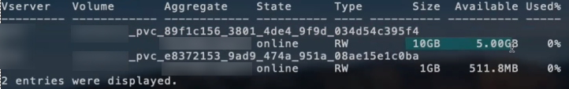

= ONTAP NAS-Konfigurationsoptionen und -Beispiele
:hardbreaks:
:allow-uri-read: 
:icons: font
:imagesdir: ../media/

[role="lead"]
ONTAP NAS-Treiber können mit Ihrer Trident-Installation erstellt und verwendet werden. In diesem Abschnitt werden Beispiele für die Backend-Konfiguration und Details zur Zuordnung von Backends zu StorageClasses bereitgestellt. Ab der Version 25.10 unterstützt NetApp Trident link:https://docs.netapp.com/us-en/ontap-afx/index.html["NetApp AFX Speichersysteme"^]. NetApp AFX-Speichersysteme unterscheiden sich von anderen ONTAP-basierten Systemen (ASA, AFF und FAS) in der Implementierung ihrer Speicherschicht.

NOTE: Nur die `ontap-nas` Der Treiber (mit NFS-Protokoll) wird für NetApp AFX-Systeme unterstützt; das SMB-Protokoll wird nicht unterstützt.

[[backend-configuration-options]]
== Back-End-Konfigurationsoptionen

In der Trident-Backend-Konfiguration müssen Sie nicht angeben, dass Ihr System ein NetApp AFX-Speichersystem ist. Wenn Sie  `ontap-nas` als  `storageDriverName` auswählen, erkennt Trident das AFX-Speichersystem automatisch. Einige Backend-Konfigurationsparameter sind für AFX-Speichersysteme nicht anwendbar.

Ab der Version 26.06 kann die ONTAP Balanced Placement-Funktion aktiviert werden, sodass ONTAP das Aggregat für neue Volumes auswählt. Balanced Placement ist für AFX Storage-Systeme mit ONTAP 9.19.1 oder neuer erforderlich. Siehe link:ontap-balanced-placement.html["Ausgewogene Platzierung mit ONTAP Backends verwenden"] für Anforderungen und Beispiele.

Die folgende Tabelle zeigt die Backend-Konfigurationsoptionen:

[cols="1,3,2"]
|===
| Parameter | Beschreibung | Standard 

| `version` |  | Immer 1 

| `storageDriverName`  a| 
Name des Speichertreibers

NOTE: Nur für NetApp AFX-Systeme `ontap-nas` wird unterstützt.
| `ontap-nas`, `ontap-nas-economy` Oder `ontap-nas-flexgroup` 

| `backendName` | Benutzerdefinierter Name oder das Storage-Backend | Treibername + „_“ + DatenLIF 

| `managementLIF` | IP-Adresse eines Clusters oder einer SVM-Management-LIF Ein vollständig qualifizierter Domain-Name (FQDN) kann angegeben werden. Kann so eingestellt werden, dass IPv6-Adressen verwendet werden, wenn Trident mit dem IPv6-Flag installiert wurde. IPv6-Adressen müssen in eckigen Klammern definiert werden, z. B. `[28e8:d9fb:a825:b7bf:69a8:d02f:9e7b:3555]`. Informationen über die nahtlose MetroCluster-Umschaltung finden Sie im <<mcc-best>>. | „10.0.0.1“, „[2001:1234:abcd::fefe]“ 

| `dataLIF` | IP-Adresse des LIF-Protokolls. NetApp empfiehlt die Angabe `dataLIF`. Wenn nicht angegeben, ruft Trident die DatenLIFs von der SVM ab. Sie können einen vollständig qualifizierten Domänennamen (FQDN) angeben, der für die NFS-Mount-Vorgänge verwendet werden soll. Dadurch können Sie ein Round-Robin-DNS erstellen, um den Lastausgleich über mehrere DatenLIFs hinweg zu ermöglichen. Kann nach der Anfangseinstellung geändert werden. Siehe . Kann so eingestellt werden, dass IPv6-Adressen verwendet werden, wenn Trident mit dem IPv6-Flag installiert wurde. IPv6-Adressen müssen in eckigen Klammern definiert werden, z. B. `[28e8:d9fb:a825:b7bf:69a8:d02f:9e7b:3555]`. *Für MetroCluster weglassen.* Siehe <<mcc-best>>. | Angegebene Adresse oder abgeleitet von SVM, falls nicht angegeben (nicht empfohlen) 

| `svm` | Zu verwendende Storage Virtual Machine

*Für MetroCluster weglassen.* Siehe <<mcc-best>>. | Abgeleitet wenn eine SVM `managementLIF` Angegeben ist 

| `autoExportPolicy` | Aktivieren Sie die automatische Erstellung von Exportrichtlinien und aktualisieren Sie [Boolean]. Mithilfe der `autoExportPolicy` Optionen und `autoExportCIDRs` kann Trident Exportrichtlinien automatisch managen. | Falsch 

| `autoExportCIDRs` | Liste der CIDRs, nach denen die Node-IPs von Kubernetes gegen gefiltert werden sollen, wenn `autoExportPolicy` aktiviert ist. Mithilfe der `autoExportPolicy` Optionen und `autoExportCIDRs` kann Trident Exportrichtlinien automatisch managen. | [„0.0.0.0/0“, „:/0“]` 

| `labels` | Satz willkürlicher JSON-formatierter Etiketten für Volumes | „“ 

| `clientCertificate` | Base64-codierter Wert des Clientzertifikats. Wird für zertifikatbasierte Authentifizierung verwendet | „“ 

| `clientPrivateKey` | Base64-kodierte Wert des privaten Client-Schlüssels. Wird für zertifikatbasierte Authentifizierung verwendet | „“ 

| `trustedCACertificate` | Base64-kodierte Wert des vertrauenswürdigen CA-Zertifikats. Optional Wird für zertifikatbasierte Authentifizierung verwendet | „“ 

| `username` | Benutzername für die Verbindung mit dem Cluster/SVM. Wird für die Authentifizierung auf Basis von Anmeldeinformationen verwendet. Informationen zur Active Directory-Authentifizierung finden Sie unter link:../trident-use/ontap-san-examples.html#authenticate-trident-to-a-backend-svm-using-active-directory-credentials["Authentifizieren Sie Trident bei einem Backend-SVM mithilfe von Active Directory-Anmeldeinformationen"]. |  

| `password` | Kennwort für die Verbindung mit dem Cluster/SVM. Wird für die Authentifizierung auf Basis von Anmeldeinformationen verwendet. Informationen zur Active Directory-Authentifizierung finden Sie unter link:../trident-use/ontap-san-examples.html#authenticate-trident-to-a-backend-svm-using-active-directory-credentials["Authentifizieren Sie Trident bei einem Backend-SVM mithilfe von Active Directory-Anmeldeinformationen"]. |  

| `storagePrefix`  a| 
Das Präfix wird beim Bereitstellen neuer Volumes in der SVM verwendet. Kann nicht aktualisiert werden, nachdem Sie sie festgelegt haben

NOTE: Bei Verwendung von ontap-nas-economy und einem storagePrefix, der 24 oder mehr Zeichen umfasst, ist das Speicherpräfix nicht in die Qtrees eingebettet, obwohl es im Volume-Namen enthalten ist.
| trident 

| `aggregate`  a| 
Aggregat für die Bereitstellung (optional; falls festgelegt, muss es der SVM zugewiesen werden). Für den  `ontap-nas-flexgroup` Treiber wird diese Option ignoriert. Wenn kein Aggregat zugewiesen ist, kann jedes der verfügbaren Aggregate zur Bereitstellung eines FlexGroup Volumes verwendet werden.

NOTE: Wird das Aggregat in SVM aktualisiert, erfolgt die Aktualisierung in Trident automatisch durch regelmäßiges Abfragen von SVM, ohne dass der Trident Controller neu gestartet werden muss. Wenn in Trident ein bestimmtes Aggregat für die Volume-Bereitstellung konfiguriert wurde und dieses Aggregat umbenannt oder aus der SVM verschoben wird, wechselt das Backend in Trident beim Abfragen des SVM-Aggregats in den Fehlerzustand. Das Aggregat muss entweder auf eines geändert werden, das in der SVM vorhanden ist, oder vollständig entfernt werden, damit das Backend wieder online ist.

*Nicht für AFX-Speichersysteme angeben.*

*Nicht angeben, wenn  `useBalancedPlacement` auf  `true` gesetzt ist.*
 a| 
„“

| `useBalancedPlacement`  a| 
Aggregatauswahl für neue Volumes an ONTAP [Boolescher Wert]. Erfordert ONTAP 9.19.1 oder höher und  `useREST` auf  `true` gesetzt. Kann nicht mit  `aggregate` kombiniert werden.

Siehe link:ontap-balanced-placement.html["Ausgewogene Platzierung mit ONTAP Backends verwenden"] für Anforderungen und Beispiele.

*Falls angegeben, immer auf  `true` für AFX Storage-Systeme unter ONTAP 9.19.1 oder höher setzen.*
| `false`; `true` für AFX Speichersysteme auf ONTAP 9.19.1 oder höher 

| `limitAggregateUsage` | Die Bereitstellung schlägt fehl, wenn die Auslastung diesen Prozentsatz überschreitet. *Gilt nicht für Amazon FSx für ONTAP*. *Nicht für AFX-Speichersysteme angeben.* | „“ (nicht standardmäßig durchgesetzt) 

| FlexgroupAggregateList  a| 
Liste der Aggregate für die Bereitstellung (optional, muss dieser SVM zugewiesen werden, falls festgelegt) Zur Bereitstellung eines FlexGroup Volumes werden alle der SVM zugewiesenen Aggregate verwendet. Unterstützt für den *ONTAP-nas-FlexGroup*-Speichertreiber.

NOTE: Wird die Aggregatliste in SVM aktualisiert, wird sie in Trident automatisch durch Abfrage von SVM aktualisiert, ohne dass der Trident Controller neu gestartet werden muss. Wenn in Trident eine bestimmte Aggregatliste für die Volume-Bereitstellung konfiguriert wurde und diese Aggregatliste umbenannt oder aus SVM verschoben wird, wechselt das Backend in Trident beim Abfragen der SVM-Aggregatliste in den Fehlerzustand. Entweder muss die Aggregatliste durch eine in SVM vorhandene ersetzt oder vollständig entfernt werden, damit das Backend wieder online ist.
| „“ 

| `limitVolumeSize` | Die Bereitstellung schlägt fehl, wenn die angeforderte Volume-Größe diesen Wert überschreitet. | „“ (standardmäßig nicht erzwungen) 

| `debugTraceFlags` | Fehler-Flags bei der Fehlerbehebung beheben. Beispiel, {„API“:false, „method“:true}

Verwenden Sie es nicht `debugTraceFlags` Es sei denn, Sie beheben Fehler und benötigen einen detaillierten Log Dump. | Null 

| `nasType` | Konfiguration der Erstellung von NFS- oder SMB-Volumes. Optionen sind `nfs` , `smb` oder null. Bei der Einstellung „null“ werden standardmäßig NFS-Volumes verwendet. *Falls angegeben, immer auf setzen `nfs` für AFX-Speichersysteme*. | `nfs` 

| `nfsMountOptions` | Kommagetrennte Liste der NFS-Mountoptionen. Die Mountoptionen für Kubernetes-persistente Volumes werden normalerweise in Speicherklassen angegeben, aber wenn in einer Speicherklasse keine Mountoptionen angegeben sind, greift Trident auf die Mountoptionen zurück, die in der Konfigurationsdatei des Storage-Backends angegeben sind. Wenn weder in der Speicherklasse noch in der Konfigurationsdatei Mountoptionen angegeben sind, setzt Trident keine Mountoptionen für das zugehörige persistente Volume. | „“ 

| `qtreesPerFlexvol` | Maximale Ques pro FlexVol, muss im Bereich [50, 300] liegen | „200“ 

| `smbShare` | Sie können eine der folgenden Optionen angeben: Den Namen einer SMB-Freigabe, die mit der Microsoft Verwaltungskonsole oder der ONTAP-CLI erstellt wurde, einen Namen, über den Trident die SMB-Freigabe erstellen kann, oder Sie können den Parameter leer lassen, um den Zugriff auf gemeinsame Freigaben auf Volumes zu verhindern. Dieser Parameter ist für On-Premises-ONTAP optional. Dieser Parameter ist für Amazon FSX for ONTAP-Back-Ends erforderlich und darf nicht leer sein. | `smb-share` 

| `useREST` | Boolescher Parameter zur Verwendung von ONTAP REST-APIs.  `useREST`Wenn eingestellt auf `true` Trident verwendet ONTAP REST-APIs zur Kommunikation mit dem Backend; wenn eingestellt auf `false` Trident verwendet ONTAPI (ZAPI)-Aufrufe zur Kommunikation mit dem Backend. Diese Funktion erfordert ONTAP 9.11.1 und höher. Darüber hinaus muss die verwendete ONTAP Anmelderolle Zugriff auf die `ontapi` Anwendung. Dies wird durch die vordefinierte Bedingung erfüllt. `vsadmin` Und `cluster-admin` Rollen. Ab der Trident Version 24.06 und ONTAP 9.15.1 oder höher, `useREST` ist eingestellt auf `true` Standardmäßig; ändern `useREST` Zu `false` ONTAPI (ZAPI)-Aufrufe verwenden. *Falls angegeben, immer auf setzen `true` für AFX-Speichersysteme*. | `true` Für ONTAP 9.15.1 oder höher, andernfalls `false`. 

| `limitVolumePoolSize` | Maximale anforderbare FlexVol-Größe bei Verwendung von Qtrees im ONTAP-nas-Economy Backend. | „“ (nicht standardmäßig durchgesetzt) 

| `denyNewVolumePools` | Schränkt das `ontap-nas-economy` Erstellen neuer FlexVol Volumes für Back-Ends ein, um ihre qtrees zu enthalten Zur Bereitstellung neuer PVS werden nur vorbestehende FlexVols verwendet. |  

| `adAdminUser` | Active Directory-Administratorbenutzer oder -Benutzergruppe mit Vollzugriff auf SMB-Freigaben. Verwenden Sie diesen Parameter, um der SMB-Freigabe Administratorrechte mit Vollzugriff zu erteilen. |  
|===

[[backend-configuration-options-for-provisioning-volumes]]
== Back-End-Konfigurationsoptionen für die Bereitstellung von Volumes

Sie können die Standardbereitstellung mit diesen Optionen im steuern `defaults` Abschnitt der Konfiguration. Ein Beispiel finden Sie unten in den Konfigurationsbeispielen.

[cols="1,3,2"]
|===
| Parameter | Beschreibung | Standard 

| `spaceAllocation` | Platzzuweisung für Qtrees | „Wahr“ 

| `spaceReserve` | Modus für Speicherplatzreservierung; „none“ (Thin) oder „Volume“ (Thick) | „Keine“ 

| `snapshotPolicy` | Die Snapshot-Richtlinie zu verwenden | „Keine“ 

| `qosPolicy` | QoS-Richtliniengruppe zur Zuweisung für erstellte Volumes Wählen Sie eine der qosPolicy oder adaptiveQosPolicy pro Storage Pool/Backend | „“ 

| `adaptiveQosPolicy` | Adaptive QoS-Richtliniengruppe mit Zuordnung für erstellte Volumes Wählen Sie eine der qosPolicy oder adaptiveQosPolicy pro Storage Pool/Backend. Nicht unterstützt durch ontap-nas-Ökonomie | „“ 

| `snapshotReserve` | Prozentsatz des für Snapshots reservierten Volumes | „0“ wenn `snapshotPolicy` Ist „keine“, andernfalls „“ 

| `splitOnClone` | Teilen Sie einen Klon bei der Erstellung von seinem übergeordneten Objekt auf | „Falsch“ 

| `encryption` | Aktivieren Sie NetApp Volume Encryption (NVE) auf dem neuen Volume; standardmäßig  `false`. NVE muss auf dem Cluster lizenziert und aktiviert sein, damit diese Option verwendet werden kann. Wenn NAE im Backend aktiviert ist, ist jedes in Trident bereitgestellte Volume NAE-aktiviert. Weitere Informationen unter: link:../trident-reco/security-reco.html["Funktionsweise von Trident mit NVE und NAE"]. | „Falsch“ 

| `tieringPolicy` | Tiering-Richtlinie, die zu „keinen“ verwendet wird |  

| `unixPermissions` | Modus für neue Volumes | „777“ für NFS Volumes; leer (nicht zutreffend) für SMB Volumes 

| `snapshotDir` | Steuert den Zugriff auf das `.snapshot` Verzeichnis | `true`, `false` (explizit festlegen). 

| `exportPolicy` | Zu verwendende Exportrichtlinie | „Standard“ 

| `securityStyle` | Sicherheitstyp für neue Volumes. NFS unterstützt `mixed` Und `unix` Sicherheitsstile. SMB unterstützt `mixed` Und `ntfs` Sicherheitsstile. | NFS-Standard ist `unix`. SMB-Standard ist `ntfs`. 

| `nameTemplate` | Vorlage zum Erstellen benutzerdefinierter Volume-Namen. | „“ 
|===

NOTE: Für die Verwendung von QoS-Richtliniengruppen mit Trident ist ONTAP 9 8 oder höher erforderlich. Sie sollten eine nicht gemeinsam genutzte QoS-Richtliniengruppe verwenden und sicherstellen, dass die Richtliniengruppe auf jede Komponente einzeln angewendet wird. Eine Shared-QoS-Richtliniengruppe erzwingt die Obergrenze für den Gesamtdurchsatz aller Workloads.

[[volume-provisioning-examples]]
=== Beispiele für die Volume-Bereitstellung

Hier ein Beispiel mit definierten Standardwerten:

[source, yaml]
----
---
version: 1
storageDriverName: ontap-nas
backendName: customBackendName
managementLIF: 10.0.0.1
dataLIF: 10.0.0.2
labels:
  k8scluster: dev1
  backend: dev1-nasbackend
svm: trident_svm
username: cluster-admin
password: <password>
limitAggregateUsage: 80%
limitVolumeSize: 50Gi
nfsMountOptions: nfsvers=4
debugTraceFlags:
  api: false
  method: true
defaults:
  spaceReserve: volume
  qosPolicy: premium
  exportPolicy: myk8scluster
  snapshotPolicy: default
  snapshotReserve: "10"
----
Für `ontap-nas` Und `ontap-nas-flexgroups` Trident verwendet nun eine neue Berechnung, um sicherzustellen, dass FlexVol mit dem SnapshotReserve-Prozentsatz und PVC korrekt dimensioniert wird. Wenn der Benutzer ein PVC anfordert, erstellt Trident das ursprüngliche FlexVol mit mehr Speicherplatz mithilfe der neuen Berechnung. Diese Berechnung stellt sicher, dass der Benutzer den von ihm angeforderten beschreibbaren Speicherplatz im PVC erhält und nicht weniger Speicherplatz als angefordert. Vor Version 21.07 erhielt der Benutzer, wenn er ein PVC (z. B. 5 GiB) mit einem SnapshotReserve von 50 Prozent anforderte, nur 2,5 GiB beschreibbaren Speicherplatz. Dies liegt daran, dass der Benutzer das gesamte Volumen angefordert hat. `snapshotReserve` ist ein Prozentsatz davon. Mit Trident 21.07 fordert der Benutzer den beschreibbaren Speicherplatz an, und Trident definiert diesen. `snapshotReserve` Zahl als Prozentsatz des Gesamtvolumens. Dies gilt nicht für `ontap-nas-economy` . Wie das funktioniert, sehen Sie im folgenden Beispiel:

Die Berechnung ist wie folgt:

[listing]
----
Total volume size = <PVC requested size> / (1 - (<snapshotReserve percentage> / 100))
----
Bei SnapshotReserve = 50 % und PVC-Anforderung = 5 GiB beträgt die Gesamtgröße des Volumes 5/.5 = 10 GiB und die verfügbare Größe beträgt 5 GiB, was der vom Benutzer in der PVC-Anforderung angeforderten Größe entspricht. Die  `volume show` Der Befehl sollte ähnliche Ergebnisse wie in diesem Beispiel anzeigen:

Bestehende Backends aus früheren Installationen stellen Volumes wie oben beschrieben bereit, wenn Trident aktualisiert wird. Für Volumes, die vor dem Upgrade erstellt wurden, sollte deren Größe angepasst werden, damit die Änderung wirksam wird. Beispielsweise führte ein 2-GiB-PVC mit  `snapshotReserve=50` zuvor zu einem Volume, das 1 GiB beschreibbaren Speicherplatz bereitstellt. Eine Größenänderung des Volumes auf beispielsweise 3 GiB stellt der Anwendung 3 GiB beschreibbaren Speicherplatz auf einem 6-GiB-Volume zur Verfügung.

[[minimal-configuration-examples]]
== Minimale Konfigurationsbeispiele

Die folgenden Beispiele zeigen grundlegende Konfigurationen, bei denen die meisten Parameter standardmäßig belassen werden. Dies ist der einfachste Weg, ein Backend zu definieren.

NOTE: Wenn Sie Amazon FSX auf NetApp ONTAP mit Trident verwenden, empfiehlt es sich, DNS-Namen für LIFs anstelle von IP-Adressen anzugeben.

.Beispiel für die NAS-Ökonomie von ONTAP
[%collapsible]
====
[source, yaml]
----
---
version: 1
storageDriverName: ontap-nas-economy
managementLIF: 10.0.0.1
dataLIF: 10.0.0.2
svm: svm_nfs
username: vsadmin
password: password
----
====
.Beispiel für ONTAP NAS FlexGroup
[%collapsible]
====
[source, yaml]
----
---
version: 1
storageDriverName: ontap-nas-flexgroup
managementLIF: 10.0.0.1
dataLIF: 10.0.0.2
svm: svm_nfs
username: vsadmin
password: password
----
====
.Beispiel: MetroCluster
[#mcc-best%collapsible]
====
Sie können das Backend so konfigurieren, dass die Backend-Definition nach Umschaltung und einem Wechsel während nicht manuell aktualisiert werden muss link:../trident-reco/backup.html#svm-replication-and-recovery["SVM-Replizierung und Recovery"].

Für nahtloses Switchover und Switchback geben Sie die SVM über an `managementLIF` Und lassen Sie die aus `dataLIF` Und `svm` Parameter. Beispiel:

[source, yaml]
----
---
version: 1
storageDriverName: ontap-nas
managementLIF: 192.168.1.66
username: vsadmin
password: password
----
====
.Beispiel: SMB Volumes
[%collapsible]
====
[source, yaml]
----
---
version: 1
backendName: ExampleBackend
storageDriverName: ontap-nas
managementLIF: 10.0.0.1
nasType: smb
securityStyle: ntfs
unixPermissions: ""
dataLIF: 10.0.0.2
svm: svm_nfs
username: vsadmin
password: password
----
====
.Beispiel für die zertifikatbasierte Authentifizierung
[%collapsible]
====
Dies ist ein minimales Beispiel für die Back-End-Konfiguration. `clientCertificate`, `clientPrivateKey`, und `trustedCACertificate` (Optional, wenn Sie eine vertrauenswürdige CA verwenden) werden ausgefüllt `backend.json` Und nehmen Sie die base64-kodierten Werte des Clientzertifikats, des privaten Schlüssels und des vertrauenswürdigen CA-Zertifikats.

[source, yaml]
----
---
version: 1
backendName: DefaultNASBackend
storageDriverName: ontap-nas
managementLIF: 10.0.0.1
dataLIF: 10.0.0.15
svm: nfs_svm
clientCertificate: ZXR0ZXJwYXB...ICMgJ3BhcGVyc2
clientPrivateKey: vciwKIyAgZG...0cnksIGRlc2NyaX
trustedCACertificate: zcyBbaG...b3Igb3duIGNsYXNz
storagePrefix: myPrefix_
----
====
.Beispiel für eine Richtlinie für den automatischen Export
[%collapsible]
====
Dieses Beispiel zeigt, wie Sie Trident anweisen können, dynamische Exportrichtlinien zu verwenden, um die Exportrichtlinie automatisch zu erstellen und zu verwalten. Dies funktioniert für die und `ontap-nas-flexgroup`-Treiber gleich `ontap-nas-economy`.

[source, yaml]
----
---
version: 1
storageDriverName: ontap-nas
managementLIF: 10.0.0.1
dataLIF: 10.0.0.2
svm: svm_nfs
labels:
  k8scluster: test-cluster-east-1a
  backend: test1-nasbackend
autoExportPolicy: true
autoExportCIDRs:
- 10.0.0.0/24
username: admin
password: password
nfsMountOptions: nfsvers=4
----
====
.Beispiel für eine ausgewogene Platzierung
[%collapsible]
====
Dieses Beispiel aktiviert die ausgewogene Platzierung in ONTAP, sodass ONTAP das Aggregat für neue Volumes auswählt. Die ausgewogene Platzierung erfordert ONTAP 9.19.1 oder höher. Weitere Informationen finden sich unter link:ontap-balanced-placement.html["Ausgewogene Platzierung mit ONTAP Backends verwenden"].

[source, yaml]
----
---
version: 1
storageDriverName: ontap-nas
backendName: nas-balanced-placement
managementLIF: 10.0.0.1
dataLIF: 10.0.0.2
svm: svm_nfs
username: vsadmin
password: password
useBalancedPlacement: true
----
====
.Beispiel für IPv6-Adressen
[%collapsible]
====
Dieses Beispiel zeigt `managementLIF` Verwenden einer IPv6-Adresse.

[source, yaml]
----
---
version: 1
storageDriverName: ontap-nas
backendName: nas_ipv6_backend
managementLIF: "[5c5d:5edf:8f:7657:bef8:109b:1b41:d491]"
labels:
  k8scluster: test-cluster-east-1a
  backend: test1-ontap-ipv6
svm: nas_ipv6_svm
username: vsadmin
password: password
----
====
.Amazon FSX für ONTAP mit SMB-Volumes – Beispiel
[%collapsible]
====
Der `smbShare` Der Parameter ist für FSX for ONTAP mit SMB Volumes erforderlich.

[source, yaml]
----
---
version: 1
backendName: SMBBackend
storageDriverName: ontap-nas
managementLIF: example.mgmt.fqdn.aws.com
nasType: smb
dataLIF: 10.0.0.15
svm: nfs_svm
smbShare: smb-share
clientCertificate: ZXR0ZXJwYXB...ICMgJ3BhcGVyc2
clientPrivateKey: vciwKIyAgZG...0cnksIGRlc2NyaX
trustedCACertificate: zcyBbaG...b3Igb3duIGNsYXNz
storagePrefix: myPrefix_
----
====
.Back-End-Konfigurationsbeispiel mit nameTemplate
[%collapsible]
====
[source, yaml]
----
---
version: 1
storageDriverName: ontap-nas
backendName: ontap-nas-backend
managementLIF: <ip address>
svm: svm0
username: <admin>
password: <password>
defaults:
  nameTemplate: "{{.volume.Name}}_{{.labels.cluster}}_{{.volume.Namespace}}_{{.vo\
    lume.RequestName}}"
labels:
  cluster: ClusterA
  PVC: "{{.volume.Namespace}}_{{.volume.RequestName}}"
----
====

[[examples-of-backends-with-virtual-pools]]
== Beispiele für Back-Ends mit virtuellen Pools

In den unten gezeigten Beispieldateien für die Backend-Definition werden spezifische Standardwerte für alle Speicherpools festgelegt, z. B. `spaceReserve` Bei keiner, `spaceAllocation` Bei false, und `encryption` Bei false. Die virtuellen Pools werden im Abschnitt Speicher definiert.

Trident legt die Bereitstellungsetiketten im Feld „Kommentare“ fest. Kommentare werden auf FlexVol für oder FlexGroup für `ontap-nas-flexgroup` gesetzt `ontap-nas`. Trident kopiert bei der Bereitstellung alle Labels, die sich in einem virtuellen Pool befinden, auf das Storage-Volume. Storage-Administratoren können Labels je virtuellen Pool definieren und Volumes nach Label gruppieren.

In diesen Beispielen legen einige Speicherpools eigene fest `spaceReserve`, `spaceAllocation`, und `encryption` Werte und einige Pools überschreiben die Standardwerte.

.Beispiel: ONTAP NAS
[%collapsible%open]
====
[source, yaml]
----
---
version: 1
storageDriverName: ontap-nas
managementLIF: 10.0.0.1
svm: svm_nfs
username: admin
password: <password>
nfsMountOptions: nfsvers=4
defaults:
  spaceReserve: none
  encryption: "false"
  qosPolicy: standard
labels:
  store: nas_store
  k8scluster: prod-cluster-1
region: us_east_1
storage:
  - labels:
      app: msoffice
      cost: "100"
    zone: us_east_1a
    defaults:
      spaceReserve: volume
      encryption: "true"
      unixPermissions: "0755"
      adaptiveQosPolicy: adaptive-premium
  - labels:
      app: slack
      cost: "75"
    zone: us_east_1b
    defaults:
      spaceReserve: none
      encryption: "true"
      unixPermissions: "0755"
  - labels:
      department: legal
      creditpoints: "5000"
    zone: us_east_1b
    defaults:
      spaceReserve: none
      encryption: "true"
      unixPermissions: "0755"
  - labels:
      app: wordpress
      cost: "50"
    zone: us_east_1c
    defaults:
      spaceReserve: none
      encryption: "true"
      unixPermissions: "0775"
  - labels:
      app: mysqldb
      cost: "25"
    zone: us_east_1d
    defaults:
      spaceReserve: volume
      encryption: "false"
      unixPermissions: "0775"

----
====
.Beispiel für ONTAP NAS FlexGroup
[%collapsible%open]
====
[source, yaml]
----
---
version: 1
storageDriverName: ontap-nas-flexgroup
managementLIF: 10.0.0.1
svm: svm_nfs
username: vsadmin
password: <password>
defaults:
  spaceReserve: none
  encryption: "false"
labels:
  store: flexgroup_store
  k8scluster: prod-cluster-1
region: us_east_1
storage:
  - labels:
      protection: gold
      creditpoints: "50000"
    zone: us_east_1a
    defaults:
      spaceReserve: volume
      encryption: "true"
      unixPermissions: "0755"
  - labels:
      protection: gold
      creditpoints: "30000"
    zone: us_east_1b
    defaults:
      spaceReserve: none
      encryption: "true"
      unixPermissions: "0755"
  - labels:
      protection: silver
      creditpoints: "20000"
    zone: us_east_1c
    defaults:
      spaceReserve: none
      encryption: "true"
      unixPermissions: "0775"
  - labels:
      protection: bronze
      creditpoints: "10000"
    zone: us_east_1d
    defaults:
      spaceReserve: volume
      encryption: "false"
      unixPermissions: "0775"

----
====
.Beispiel für die NAS-Ökonomie von ONTAP
[%collapsible%open]
====
[source, yaml]
----
---
version: 1
storageDriverName: ontap-nas-economy
managementLIF: 10.0.0.1
svm: svm_nfs
username: vsadmin
password: <password>
defaults:
  spaceReserve: none
  encryption: "false"
labels:
  store: nas_economy_store
region: us_east_1
storage:
  - labels:
      department: finance
      creditpoints: "6000"
    zone: us_east_1a
    defaults:
      spaceReserve: volume
      encryption: "true"
      unixPermissions: "0755"
  - labels:
      protection: bronze
      creditpoints: "5000"
    zone: us_east_1b
    defaults:
      spaceReserve: none
      encryption: "true"
      unixPermissions: "0755"
  - labels:
      department: engineering
      creditpoints: "3000"
    zone: us_east_1c
    defaults:
      spaceReserve: none
      encryption: "true"
      unixPermissions: "0775"
  - labels:
      department: humanresource
      creditpoints: "2000"
    zone: us_east_1d
    defaults:
      spaceReserve: volume
      encryption: "false"
      unixPermissions: "0775"

----
====

[[map-backends-to-storageclasses]]
== Back-Ends StorageClasses zuordnen

Die folgenden StorageClass-Definitionen beziehen sich auf <<Beispiele für Back-Ends mit virtuellen Pools>>. Mit dem  `parameters.selector`-Feld wird bei jeder StorageClass angegeben, welche virtuellen Pools zum Hosten eines Volumes verwendet werden können. Das Volume besitzt die im gewählten virtuellen Pool definierten Aspekte.

* Die `protection-gold` StorageClass wird den ersten und zweiten virtuellen Pool im `ontap-nas-flexgroup` Backend zugeordnet. Nur diese beiden Pools bieten Schutz auf Goldniveau.
+
[source, yaml]
----
apiVersion: storage.k8s.io/v1
kind: StorageClass
metadata:
  name: protection-gold
provisioner: csi.trident.netapp.io
parameters:
  selector: "protection=gold"
  fsType: "ext4"
----
* Die `protection-not-gold` StorageClass verweist auf den dritten und vierten virtuellen Pool im `ontap-nas-flexgroup` Backend. Dies sind die einzigen Pools, die ein anderes Schutzniveau als Gold bieten.
+
[source, yaml]
----
apiVersion: storage.k8s.io/v1
kind: StorageClass
metadata:
  name: protection-not-gold
provisioner: csi.trident.netapp.io
parameters:
  selector: "protection!=gold"
  fsType: "ext4"
----
* Die `app-mysqldb` StorageClass wird dem vierten virtuellen Pool im `ontap-nas` Backend zugeordnet. Dies ist der einzige Pool, der eine Speicherpoolkonfiguration für Anwendungen vom Typ mysqldb bietet.
+
[source, yaml]
----
apiVersion: storage.k8s.io/v1
kind: StorageClass
metadata:
  name: app-mysqldb
provisioner: csi.trident.netapp.io
parameters:
  selector: "app=mysqldb"
  fsType: "ext4"
----
* Die `protection-silver-creditpoints-20k` StorageClass verweist auf den dritten virtuellen Pool im `ontap-nas-flexgroup` Backend. Dies ist der einzige Pool, der Schutz auf Silber-Niveau und 20000 Kreditpunkte bietet.
+
[source, yaml]
----
apiVersion: storage.k8s.io/v1
kind: StorageClass
metadata:
  name: protection-silver-creditpoints-20k
provisioner: csi.trident.netapp.io
parameters:
  selector: "protection=silver; creditpoints=20000"
  fsType: "ext4"
----
* Die  `creditpoints-5k` StorageClass entspricht dem dritten virtuellen Pool im  `ontap-nas` Backend und dem zweiten virtuellen Pool im  `ontap-nas-economy` Backend. Dies sind die einzigen Poolangebote mit 5000 Kreditpunkten.
+
[source, yaml]
----
apiVersion: storage.k8s.io/v1
kind: StorageClass
metadata:
  name: creditpoints-5k
provisioner: csi.trident.netapp.io
parameters:
  selector: "creditpoints=5000"
  fsType: "ext4"
----

Trident entscheidet, welcher virtuelle Pool ausgewählt wird und stellt sicher, dass die Speicheranforderung erfüllt wird.

[[update-datalif-after-initial-configuration]]
== Aktualisierung `dataLIF` Nach der Erstkonfiguration

Sie können die dataLIF nach der Erstkonfiguration ändern, indem Sie den folgenden Befehl ausführen, um die neue Backend-JSON-Datei mit aktualisierter dataLIF bereitzustellen.

[listing]
----
tridentctl update backend <backend-name> -f <path-to-backend-json-file-with-updated-dataLIF>
----

NOTE: Wenn PVCs an einen oder mehrere Pods angeschlossen sind, müssen Sie alle entsprechenden Pods herunterfahren und sie dann wieder erstellen, damit die neue DataLIF wirksam wird.

[[secure-smb-examples]]
== Beispiele für sichere SMBs

[[backend-configuration-with-ontap-nas-driver]]
=== Backend-Konfiguration mit Ontap-Nas-Treiber

[source, yaml]
----
apiVersion: trident.netapp.io/v1
kind: TridentBackendConfig
metadata:
  name: backend-tbc-ontap-nas
  namespace: trident
spec:
  version: 1
  storageDriverName: ontap-nas
  managementLIF: 10.0.0.1
  svm: svm2
  nasType: smb
  defaults:
    adAdminUser: tridentADtest
  credentials:
    name: backend-tbc-ontap-invest-secret
----

[[backend-configuration-with-ontap-nas-economy-driver]]
=== Backend-Konfiguration mit dem Ontap-Nas-Economy-Treiber

[source, yaml]
----
apiVersion: trident.netapp.io/v1
kind: TridentBackendConfig
metadata:
  name: backend-tbc-ontap-nas
  namespace: trident
spec:
  version: 1
  storageDriverName: ontap-nas-economy
  managementLIF: 10.0.0.1
  svm: svm2
  nasType: smb
  defaults:
    adAdminUser: tridentADtest
  credentials:
    name: backend-tbc-ontap-invest-secret
----

[[backend-configuration-with-storage-pool]]
=== Backend-Konfiguration mit Speicherpool

[source, yaml]
----
apiVersion: trident.netapp.io/v1
kind: TridentBackendConfig
metadata:
  name: backend-tbc-ontap-nas
  namespace: trident
spec:
  version: 1
  storageDriverName: ontap-nas
  managementLIF: 10.0.0.1
  svm: svm0
  useREST: false
  storage:
  - labels:
      app: msoffice
    defaults:
      adAdminUser: tridentADuser
  nasType: smb
  credentials:
    name: backend-tbc-ontap-invest-secret

----

[[storage-class-example-with-ontap-nas-driver]]
=== Beispiel einer Speicherklasse mit dem Ontap-Nas-Treiber

[source, yaml]
----
apiVersion: storage.k8s.io/v1
kind: StorageClass
metadata:
  name: ontap-smb-sc
  annotations:
    trident.netapp.io/smbShareAdUserPermission: change
    trident.netapp.io/smbShareAdUser: tridentADtest
parameters:
  backendType: ontap-nas
  csi.storage.k8s.io/node-stage-secret-name: smbcreds
  csi.storage.k8s.io/node-stage-secret-namespace: trident
  trident.netapp.io/nasType: smb
provisioner: csi.trident.netapp.io
reclaimPolicy: Delete
volumeBindingMode: Immediate
----

NOTE: Stellen Sie sicher, dass Sie hinzufügen  `annotations` um sicheres SMB zu aktivieren. Sicheres SMB funktioniert ohne die Anmerkungen nicht, unabhängig von den im Backend oder PVC festgelegten Konfigurationen.

[[storage-class-example-with-ontap-nas-economy-driver]]
=== Beispiel einer Speicherklasse mit dem Treiber ontap-nas-economy

[source, yaml]
----
apiVersion: storage.k8s.io/v1
kind: StorageClass
metadata:
  name: ontap-smb-sc
  annotations:
    trident.netapp.io/smbShareAdUserPermission: change
    trident.netapp.io/smbShareAdUser: tridentADuser3
parameters:
  backendType: ontap-nas-economy
  csi.storage.k8s.io/node-stage-secret-name: smbcreds
  csi.storage.k8s.io/node-stage-secret-namespace: trident
  trident.netapp.io/nasType: smb
provisioner: csi.trident.netapp.io
reclaimPolicy: Delete
volumeBindingMode: Immediate
----

[[pvc-example-with-a-single-ad-user]]
=== PVC-Beispiel mit einem einzelnen AD-Benutzer

[source, yaml]
----
apiVersion: v1
kind: PersistentVolumeClaim
metadata:
  name: my-pvc4
  namespace: trident
  annotations:
    trident.netapp.io/smbShareAccessControl: |
      change:
        - tridentADtest
      read:
        - tridentADuser
spec:
  accessModes:
    - ReadWriteOnce
  resources:
    requests:
      storage: 1Gi
  storageClassName: ontap-smb-sc
----

[[pvc-example-with-multiple-ad-users]]
=== PVC-Beispiel mit mehreren AD-Benutzern

[source, yaml]
----
apiVersion: v1
kind: PersistentVolumeClaim
metadata:
  name: my-test-pvc
  annotations:
    trident.netapp.io/smbShareAccessControl: |
      full_control:
        - tridentTestuser
        - tridentuser
        - tridentTestuser1
        - tridentuser1
      change:
        - tridentADuser
        - tridentADuser1
        - tridentADuser4
        - tridentTestuser2
      read:
        - tridentTestuser2
        - tridentTestuser3
        - tridentADuser2
        - tridentADuser3
spec:
  accessModes:
    - ReadWriteOnce
  resources:
    requests:
      storage: 1Gi
----